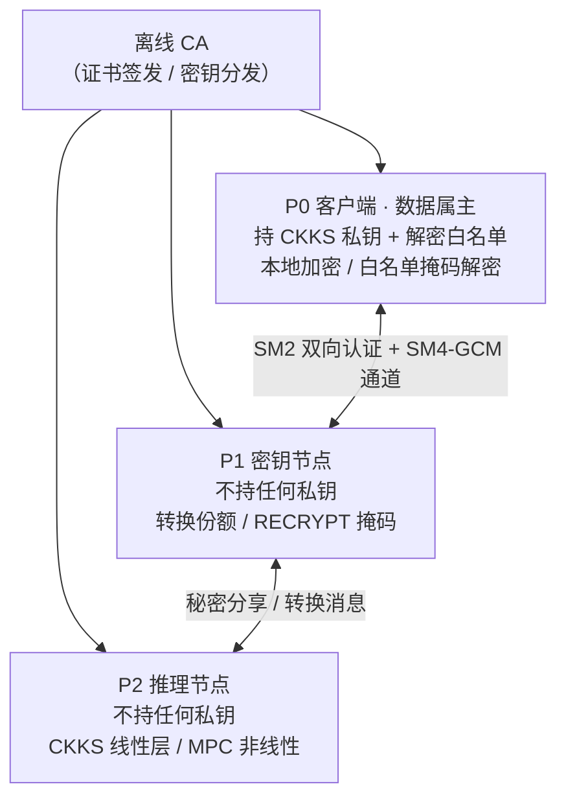
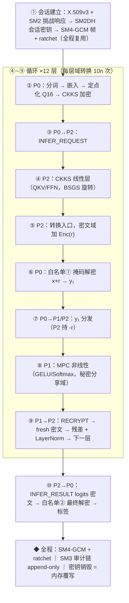
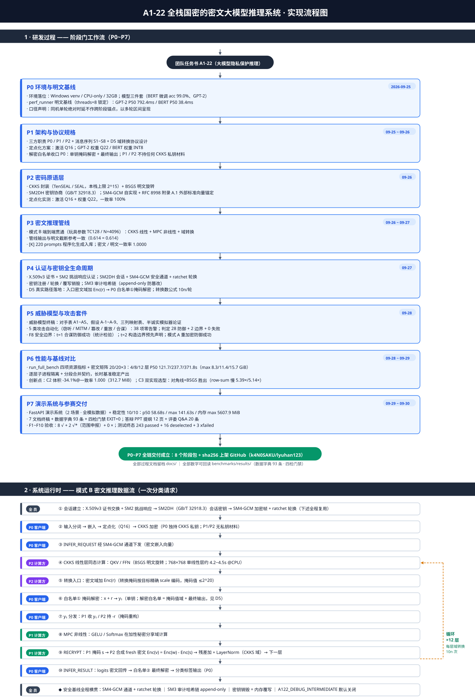

# A1-22 · 面向大模型隐私保护的密码方案

> 第十一届全国密码技术竞赛复赛 A1-22 题参赛作品 ｜ 全栈国密 ｜ P0~P7 全链交付，评审验收关闭


**一句话**：用户输入在本地加密，大模型推理全程只见密文与秘密分享——政务/企业敏感
文本的情感研判结果经"白名单掩码解密"返回客户端，推理节点自始至终拿不到明文；
SM2/SM3/SM4-GCM 管住身份认证、完整性校验与密钥全生命周期。

|  |  |
|---|---|
| 密码栈 | CKKS（TenSEAL/SEAL）· 模 2^k 加法秘密分享 · Beaver 三元组 · 国密 SM2/SM3/SM4-GCM |
| 模型 | BERT-base-chinese 情感二分类（演示主线，微调 acc 99.0%）· GPT-2 124M（生成口径） |
| 形态 | 三方节点（P0 客户端 / P1 密钥节点 / P2 推理节点）+ 离线 CA + FastAPI 演示系统 |
| 规模 | 代码 9,949 行 · 测试 243 passed + 16 deselected + 3 xfailed · 数据字典 93 条四检全绿 |

## 目录

1. [为什么需要这个项目](#1-为什么需要这个项目)
2. [30 秒读懂方案](#2-30-秒读懂方案)
3. [名词速查表](#3-名词速查表)
4. [一次密文推理的完整旅程](#4-一次密文推理的完整旅程)
5. [密码方案分层拆解](#5-密码方案分层拆解)
6. [实测结果](#6-实测结果)
7. [威胁模型与攻击测试](#7-威胁模型与攻击测试)
8. [诚实申报清单](#8-诚实申报清单)
9. [快速开始](#9-快速开始)
10. [仓库结构导览](#10-仓库结构导览)
11. [质量门禁与证据纪律](#11-质量门禁与证据纪律)
12. [项目实现全流程](#12-项目实现全流程)
13. [答辩与延伸材料](#13-答辩与延伸材料)
14. [常见问题](#14-常见问题)
15. [License](#15-license)

---

## 1. 为什么需要这个项目

**场景一：政务。** 12345 市民热线、一网通办、窗口评价等系统把群众的姓名、证件号、
住址与诉求文本一起送入大模型做摘要、情绪研判与工单分派。按《个人信息保护法》与
等级保护要求，这类数据不得明文出域；而直接把文本粘进公有大模型 API，等于把
"张伟，身份证 110101\*\*\*\*1234，投诉窗口态度"原文交给了第三方——**监管风险与
业务效率直接冲突**：不用大模型，工单堆压；用了，隐私裸奔。

**场景二：企业。** 客服工单、故障报单、内部日志里常含客户手机号、订单号、安全事件
细节。企业希望用大模型自动分类定级（敏感单需安全团队介入），但数据出企业边界即
违反内控与行业合规（金融/医疗尤甚）。

三个共性约束（题面点名，本方案逐条回应）：

| 约束 | 含义 | 本方案的回应 |
|---|---|---|
| **可用不可见** | 推理必须完成，但原始输入与中间激活不得泄露给任何一方 | 输入只在 P0 本地加密；P1/P2 全程只见密文与秘密分享（§4） |
| **资源可落地** | 中小企业没有 GPU 集群——方案要能在普通服务器运行、开销可预期 | 全栈 CPU-only 实测；四项资源指标（代码/内存/时延/流量）逐项如实申报（§6） |
| **商用密码合规** | 国内政企采购要求国密算法支撑身份与传输安全 | 控制面全链国密：SM2 认证/密钥协商、SM4-GCM 通道、SM3 审计链（§5.5） |

现状做法为什么不行：明文直传（无保护）；平台侧隐私条款承诺（不可验证、不可审计）；
传统 MPC/FHE 框架直接上（无国密、无业务身份体系、部署重、时延或资源失控）——
逐项对比见 [docs/04-性能与基线对比.md](docs/04-性能与基线对比.md)。

## 2. 30 秒读懂方案

把推理任务拆给三个互不信任的节点，用密码学保证"谁也拼不出明文"：

| 角色 | 拿到什么 | 拿不到什么 |
|---|---|---|
| **P0 客户端**（数据属主） | 明文输入、CKKS 私钥、解密白名单 | ——（数据出自己手之前就已加密） |
| **P1 密钥节点** | 密文份额、随机掩码 | 任何明文（不持任何私钥） |
| **P2 推理节点** | CKKS 密文、秘密分享 | 任何明文（不持任何私钥） |
| **离线 CA** | 证书签发、密钥分发 | 不参与推理，不接触业务数据 |



两条运行模式（如实申报）：

- **模式 B**（主线，演示与评测采用）：CKKS 密文跑线性层 + MPC 跑非线性层，
  中间用 D5 转换协议在两种密文形态间切换；
- **模式 A**（纯秘密分享全 MPC）：题面路线提示之一。本栈如实申报**不可实例化**
  （SEAL 参数上限，详见 [docs/01 §5.3](docs/01-架构与协议规格.md)），
  理论推演保留；攻击测试对两模式分别执行，不混淆口径。

## 3. 名词速查表

| 名词 | 一句话解释 |
|---|---|
| **同态加密 / CKKS** | 一种"能直接对密文做算术"的加密；CKKS 支持实数向量的加法与近似乘法，适合神经网络线性层 |
| **MPC（安全多方计算）** | 多方各持一份秘密输入，协作算出结果但互相不知道对方的输入 |
| **加性秘密分享** | 把秘密 x 拆成 r 与 x−r 两份分给两方；单独任一份都是均匀随机数，合起来才是真值 |
| **Beaver 三元组** | 预生成的一组随机数 (a,b,c) 满足 a·b=c，让 MPC 里"密文乘密文"只需一次开放操作 |
| **域转换（D5 协议）** | 在 CKKS 密文形态与秘密分享形态之间切换的协议——本方案的关键粘合剂（§5.2） |
| **白名单掩码解密** | P0 只对"转换掩码"和"最终输出"两类值解密，且只能得到白名单值域内的结果（§5.4） |
| **SM2 / SM3 / SM4** | 国密算法：SM2 椭圆曲线公钥密码（签名/密钥协商）、SM3 哈希、SM4 分组密码 |
| **SM4-GCM** | SM4 的认证加密模式：同时保证机密性与完整性（本仓库自实现并以 RFC 8998 标准向量锚定） |
| **ratchet（棘轮）** | 会话密钥按规则持续轮换，单条密钥泄露不影响前后流量的机密性 |
| **半诚实模型** | 敌手会忠执行程、试图从看到的数据里捞信息——本方案的安全声明口径（§7） |
| **定点化（Q16/Q22）** | 把浮点数按固定小数位缩放成整数，让密码电路能算——激活 Q16、GPT-2 权重 Q22 |

更完整的术语表见 [docs/glossary.md](docs/glossary.md)。

## 4. 一次密文推理的完整旅程

以一次情感分类请求为例（BERT 12 层；演示管线为截断层口径）：



为什么每一步都不泄密：

| 步骤 | 谁看见什么 | 为什么安全 |
|---|---|---|
| ② 本地加密 | 明文只存在于 P0 内存 | 输入加密后才离开 P0，通道上还有 SM4-GCM 加密 |
| ④ CKKS 线性层 | P2 只见 CKKS 密文 | CKKS 在无私钥时不可逆（IND-CPA，§7 攻击实证） |
| ⑥ 掩码解密 | P0 解出的是 x+r，被掩码 r 遮住 | r 均匀随机且只有 P2 知道 −r；解密白名单限定值域与次数 |
| ⑧ MPC 非线性 | P1/P2 各持一份加性分享 | 单份是均匀随机数；t=1 合谋恢复不了输入（§7） |
| ⑩ 结果解密 | P0 只解出最终 logits | 解密白名单②只含最终输出这一处 |

## 5. 密码方案分层拆解

### 5.1 数据面 · CKKS 线性层

- 权重用**对角线方法**打包进明文多项式，密文向量乘权重矩阵化为一系列
  密文旋转 + 明文乘加；旋转用 **BSGS**（baby-step giant-step）分解降低旋转次数；
- 本栈（TenSEAL 0.3.14 / SEAL）密文维度上限 **2^15 = 16384 槽**（n≥2^16 一律
  被 SEAL 校验拒绝，决策记录见 [docs/01 §5.3](docs/01-架构与协议规格.md)）；
- 实测：768×768 单线性层约 4.2~4.5s（CPU，L=2 回环）——这是全系统时延的
  主导项之一，如实呈现（§6）。

### 5.2 关键难点 · 域转换协议 D5

线性层输出是 CKKS 密文，非线性层要的是加性秘密分享——两者之间靠 D5 协议切换：

1. **入口**：P2 在密文域加随机掩码 `Enc(r)`（r 按目标精确 scale 编码，值 ≤2^20）；
2. **掩码解密**：P0 用单钥对 `x+r` 做白名单①掩码解密得到 `y₁`，分发给
   P1（收 y₁）与 P2（自持 −r）；
3. **MPC 非线性**：两方在加性分享域完成 GELU/Softmax；
4. **出口（RECRYPT）**：P1 再取掩码 s，P2 合成全新鲜密文
   `Enc(v) = Enc(w) − Enc(s)`，回到 CKKS 域进下一层。

工程上踩过的三道精度墙（rescale 素数非精确 2^k 导致的 scale 漂移、float64 的
2^53 精确整数域、掩码量级放大编码残差）及其修法（按目标精确 scale 编码、
round(y·2^16)、掩码值统一 ≤2^20），完整记录在
[docs/code-walkthrough.md](docs/code-walkthrough.md) 与 P3/P4 工作记录。
每层 Transformer 触发 **10n 次域转换**（n 为 token 数）。

### 5.3 非线性算子 · MPC

GELU/Softmax 等非线性无法直接同态计算，用 **minimax 多项式近似** +
**Beaver 三元组在线乘法**在秘密分享域完成；三元组由离线预生成
（`src/nodes/offline_triple_gen.py`）。

### 5.4 解密白名单

P0 虽然持有唯一私钥，但解密被约束在**白名单**内：①域转换掩码值（且值域受限）、
②最终输出。设计意图：即便 P0 侧实现被滥用，也不存在"随手解出中间激活"的路径。
这是 P1-R1 评审对 D5 的关键修订（职责收口，见 §12）。

### 5.5 控制面 · 全链国密

| 组件 | 做法 | 质量锚点 |
|---|---|---|
| 身份认证 | X.509v3 结构化证书 + SM2 挑战响应双向认证（离线 CA） | 演示级证书体系如实申报（§8）；协议族测试覆盖 |
| 密钥协商 | SM2DH 会话密钥（GB/T 32918.3） | 双端密钥一致性由规范标签派生 |
| 安全通道 | SM4-GCM 认证加密，自实现（gmssl 无 GCM） | **RFC 8998 附录 A.1 外部标准向量锚定**——自洽/篡改/代数测试都发现不了的计数器偏移，靠它暴露 |
| 密钥轮换 | ratchet 前向轮换 + KEY_ROTATE（transcript 基准=本帧前链值） | 单帧密钥泄露不回溯污染 |
| 审计 | SM3 哈希链 append-only，防篡改 | 并发竞态修复后补 200 线程并发 append 固化测试 |
| 销毁 | 密钥状态机 + 两遍覆写零化 | 生命周期测试覆盖注册→轮换→销毁全链 |

### 5.6 参数与安全强度

CKKS 参数采用 **2^15 提交主线 + 2^16 评审路径**双口径（[docs/01](docs/01-架构与协议规格.md)
参数表）；安全强度用 **lattice-estimator（malb）@ SageMath** 实测评估，
估计脚本、原生日志与完整事故链存档于
`benchmarks/results/security_estimator.json` 与 `benchmarks/results/estimator_logs/`。

## 6. 实测结果

> 每个数字都可回读到生成它的 JSON（§11 证据纪律）；"口径"列防止误读。

| 指标 | 数值 | 口径 | 证据 |
|---|---|---|---|
| 密文推理精度 | **99.00%**（vs FP32 差 0.00pp） | 自建集 n=200 同源对照；满配口径 | `benchmarks/results/pipeline_accuracy_*.json` |
| 定点化一致率 | **100%** | 激活 Q16 + 权重 Q22 vs 浮点 | `quantize_eval_*.json` |
| 明文基线 | BERT **23.6ms** / GPT-2 **677.2ms** | 单轮 P50，20 轮，threads=8 | `p6_full_bench.json::plaintext` |
| 密文矩阵耗时 | 4/8/12 层 P50 **121.7 / 237.7 / 371.8s** | 20/20×3 配置，L=2 回环 CPU，截断层性能口径 | `p6_full_bench.json::cipher_matrix` |
| 密文矩阵峰值内存 | **8.3 / 11.4 / 15.7 GiB**（max） | 同上；12 层最长单轮 1981.6s | 同上 |
| 转换通信 | GB 级/请求的诚实预算 | 转换主导通信，逐请求字节见 docs/04 | `docs/04` |
| C2 模型瘦身选型（创新点） | 模型体积**省 34.1%**（474.7→312.7 MiB），瘦身前后预测结果**一字不差**（一致率 1.000） | 最优组合=卷积/线性权重存 fp16 + 嵌入层 22 位定点（conv_fp16+emb_q22）；判据=端到端预测一致（白话版见下） | `p6_full_bench.json::c2_selector` |
| C3 密文矩阵乘同题竞赛（创新点） | "行和"算法**慢 5.39×/5.14×**（向量维度 256/512），对角线+BSGS 胜出 | 早期预估行和法快 1.3×，实测被推翻——**如实入报告的负结果**（白话版见下） | `p6_full_bench.json::c3_ab` |
| 攻击判定 | **28 防御成功 + 2 边界演示 + 0 失败** | 五类攻击 30 项判定 | `attack_verdicts.json` |
| 演示稳定性 | **10/10 轮零故障**；轮耗时 p50 58.68s / p95 106.34s / max 141.63s；内存 max 5607.9 MiB；流量 330.4 MiB | 截断演示管线（2 层 8 token）真实 HTTP | `p7_demo_stability.json` |
| 测试 | **243 passed + 16 deselected + 3 xfailed**；攻击套件 38 项 | pytest 默认口径（slow 已排除） | `python -m pytest -q` |

**两个创新点的白话版**：

- **C2 = 给模型"瘦身"的自动选型器。** 加密计算前，模型权重必须先从浮点数压成
  整数（定点化）：压得太狠会算错，压得太轻模型太大。选型器把各种压缩组合逐一
  试算，自动挑出"体积最小、且预测结果与压缩前完全一致"的一组——结果：模型文件
  从 474.7 MiB 瘦到 312.7 MiB（省 34.1%），预测与瘦身前一字不差。这里有个如实
  记录的教训：按"单层误差小"挑组合会翻车（如嵌入层压到 8 位整数时，一致率从
  1.000 跌到 0.3063），所以判据必须用"端到端预测一字不差"这道闸门。
- **C3 = 两种"密文×权重矩阵"算法的同题竞赛。** 密文推理的每个线性层都要算
  "加密向量 × 权重矩阵"。业界常用"对角线打包+旋转"法，另有一种看起来更简单的
  "行和"法。同一道题、两种实现、各跑一遍：行和法反而慢 5.39 倍（向量维度 256）/
  5.14 倍（维度 512）——早期曾预估它快 1.3 倍，被实测推翻。我们把"当初为什么
  预估错、错在哪"如实写进报告，最终选型对角线+BSGS。

性能位置（如实）：密文路径为分钟级（回环 CPU、截断层口径），与文献 MPC 方案
同处"数量级开销"区间；差异在结构——同态分段刷新减少交互轮次、转换主导通信、
单机可跑（文献均为 Linux 集群口径）。逐项五维对比（本机/SPU/PUMA/MPCFormer/
BumbleBee，含"不可比因素"申报列）见 [docs/04](docs/04-性能与基线对比.md)。

## 7. 威胁模型与攻击测试

- **敌手口径**：半诚实参与方 + 恶意网络；敌手能力表 A1~A5、假设核对表
  A-1~A-9、半诚实模拟器论证见 [docs/02-威胁模型与安全分析.md](docs/02-威胁模型与安全分析.md)；
- **合谋门限**：n=3, t=1 精确到门限——P1 或 P2 单独不可恢复输入（OTP/无钥，
  统计检验）；**P1+P2 合谋即失守（t=2）**，这是模式 B 的构造边界，已预先声明
  并自动化演示（2 项边界判定），缓解路径=模式 A 全密文或 2-of-3 门限（02 §3.3）；
- **模式 A 防御**：CKKS IND-CPA + 重加密——同明文重加密字节重合率 ≈1/256
  （随机性实证）。

五类攻击自动化测试（`tests/attack/`，38 项用例 → 30 项判定）：

| 攻击类型 | 攻击者动作 | 结果 |
|---|---|---|
| 窃听 | 全程抓取通道字节做模式扫描/熵分析 | 防御成功 |
| 中间人 | 替换证书/篡改握手转录 | 防御成功（证书校验 + transcript 链） |
| 结果篡改 | 修改密文/审计链注入 | 防御成功（GCM 认证标签 + SM3 链校验） |
| 重放 | 重发历史密文帧 | 防御成功（序列号 + 滑动窗口拒绝） |
| 合谋 | t=1 / t=2 节点联合推理 | t=1 防御成功；t=2 边界演示（预先申报） |

复跑口径注意：`attack_verdicts.json` 每次会话覆盖，完整判定集需单次会话
`python -m pytest tests/attack -o addopts=` 落盘（§9）。

## 8. 诚实申报清单

这套项目把"不隐藏弱点"当作交付物的一部分——以下全部已登记、可核查
（[docs/00 §3](docs/00-方案概述.md)）：

1. **时延差距**：现网明文服务百毫秒级，本方案密文路径分钟级（回环 CPU）——
   瓶颈为 CKKS 明文矩阵乘与转换往返；GPU/定点线性层/转换批量化是工程优化路径；
2. **模式 A 缺口**：全密文本受本栈 SEAL 参数上限阻断——理论推演保留，
   需换 OpenFHE 级后端；
3. **证书体系演示级**：结构化签名对象，商用需替换 GM X.509 证书链；
4. **纯国密数据面缺口**：控制面全链国密，密文计算引擎为国际标准 CKKS——
   纯国密同态库依赖国产生态，列为扩展方向；
5. **底座模型为演示级**：情感二分类微调（acc 99.0%）+ 截断层数演示管线——
   业务语义映射为示例，非生产模型；
6. **外部效度锚点缺失**：精度评测目前为自建数据集同源对照（n=200），
   ChnSentiCorp 等公开集三口径待补——已终裁移交提交后可选窗口，
   按"已登记未完成"口径如实应答。

## 9. 快速开始

环境要求：**Python 3.10+，CPU-only 即可**（实测开发机 Windows / 32GB 内存）；
首次运行需联网下载模型约 1.5GB（HuggingFace 不可达时自动切换 hf-mirror.com 镜像）。

```bash
# 1) 环境与依赖
python -m venv .venv && source .venv/bin/activate      # Windows: .venv\Scripts\activate
pip install -r requirements.txt                        # 精确复现用 requirements-lock.txt

# 2) 模型与微调检查点
python -m benchmarks.download_models                   # BERT/GPT-2 三件套（HF/镜像自动探测）
python -m benchmarks.finetune_bert                     # 情感分类头微调（CPU 数分钟，acc 99.0%）

# 3) 跑演示系统（全模拟数据，浏览器打开 http://127.0.0.1:8060/）
python -m src.demo.app --port 8060
```

**测试三档**：

```bash
python -m pytest -q                        # 默认口径：243 passed + 16 deselected + 3 xfailed
python -m pytest tests/attack -o addopts=  # 攻击套件 38 项（~5 分钟；单次会话落盘 attack_verdicts.json）
python -m pytest -m slow -q                # 演示稳定性 10 轮等慢速项（~12 分钟）
```

**复现基准**（数字只能由这些脚本写入 `benchmarks/results/`）：

```bash
python -m benchmarks.perf_runner                                        # 明文基线（多轮区间呈现）
python -m benchmarks.run_full_bench --parts cipher_matrix --cipher-rounds 20 --segmented   # 密文矩阵（分段子进程，防 OOM）
python -m benchmarks.run_full_bench --parts c2_selector,c3_ab --rounds 20                  # 创新点 A/B
python -m benchmarks.run_full_bench --parts tables                                          # 汇总表注入 docs/04/05
```

**一键复现**（干净目录 6 步链：venv→依赖→模型→管线→基准→攻击，
证据存档 `reproduce_logs/`，详见 [docs/06-复现手册.md](docs/06-复现手册.md)）：

```bash
bash scripts/reproduce.sh
```

**文档一致性门禁**（改任何文档后必跑）：

```bash
python scripts/check_docs_consistency.py   # 四检：字典回读/注入表/过期值黑名单/互引
```

## 10. 仓库结构导览

```
├─ src/                      # 系统源码（9,949 行的一部分）
│  ├─ protocol/              #   消息序列 messages · 认证 auth · 会话 session（SM2DH/GCM/ratchet）
│  │                         #   密钥生命周期 keylifecycle · 审计链 audit_log · 域转换 conversion（D5）
│  ├─ crypto/                #   ckks_ops（CKKS 封装/BSGS）· secret_sharing · beaver · gm_cipher（SM4-GCM）· threshold
│  ├─ model/                 #   pipeline（密文推理主管线）· quantize（定点化）· ops/（linear/minimax/packing/rowsum）
│  ├─ nodes/                 #   client / keynode / infernode 三方节点 + offline_triple_gen + 组网 provision
│  ├─ common/                #   perf 指标 · envinfo 环境快照 · netmeter 流量计量
│  └─ demo/                  #   FastAPI 演示系统（2 场景，全模拟数据）+ 单页 UI
├─ benchmarks/               # 全部性能/安全数字的唯一合法产地（D8 纪律）
│  ├─ perf_runner.py         #   明文基线（多轮区间呈现，threads 锁定）
│  ├─ run_full_bench.py      #   四项资源指标 + 密文矩阵 + 创新点 A/B（--segmented 分段防 OOM）
│  ├─ eval_pipeline_accuracy.py / eval_quantize.py / finetune_bert.py / download_models.py
│  ├─ security_estimator.py  #   格估计器对接（lattice-estimator @ SageMath/WSL）
│  ├─ package_phase.py       #   阶段打包器（pN.zip + MANIFEST + sha256）
│  └─ results/               #   全部实测 JSON（UTC 时间戳）+ estimator 原生日志存档
├─ tests/                    # 三层测试
│  ├─ unit/                  #   原语/协议/管线单元测试
│  ├─ attack/                #   五类攻击套件 + 内存取证框架 framework.py
│  └─ e2e/                   #   端到端：管线/生命周期/明文基线/演示稳定性（真实 uvicorn HTTP）
├─ docs/                     # 参赛文档七件套 + 数据字典 + 攻击/防御材料（§13）
├─ scripts/                  # check_docs_consistency（四检）· gen_data_dict · reproduce.sh · predefense/
├─ deliverables/             # p0~p7 八个阶段交付包 + sha256 侧车
├─ reproduce_logs/           # 干净目录一键复现的逐步证据
└─ data/models/              # 模型文件（~1.5GB，不入库：python -m benchmarks.download_models 一键复现）
```

## 11. 质量门禁与证据纪律

这套项目最看重的不是某个单点数字，而是**每个数字都能被第三方重新算出来**：

- **D8 纪律**：性能数字只允许由 benchmark 脚本写入 `benchmarks/results/`
  （UTC 时间戳 JSON）；文档引用必须与 JSON 一致，禁止手填——违反过就回滚重来；
- **数据字典**：`docs/data_dict.json` 收录 **93 条**指针，每个文档主张都能回读到
  具体 JSON 字段；由 `scripts/gen_data_dict.py` 自动生成；
- **四检门禁**（`scripts/check_docs_consistency.py`，EXIT=0 才算过）：
  ① 字典 ↔ 源 JSON 回读一致；② 注入表与 JSON 字节一致；③ 过期值黑名单
  零命中（黑名单正是历轮评审揪出过的错误数字）；④ 文档互引完整；
- **如实申报**：模式 A 不可实例化、t=2 合谋为预先声明的构造边界、公开数据集
  外部效度待补——全部登记在案，不做隐藏性声明（§8）。

## 12. 项目实现全流程

开发全程采用**阶段门工作流**：P0~P7 每阶段末输出工作记录 + 交付包（pN.zip +
MANIFEST + sha256）+ 阶段报告，**停下等团队评审签字**后才进下一阶段；
8 轮评审退回（R1~R3）全部整改闭环并留档（`docs/review/`）。

<p align="center">
  
</p>

| 阶段 | 目标 | 状态 |
|---|---|---|
| P0 | 环境、明文基线（GPT-2 P50 792.4ms / BERT 38.4ms，threads=8）、定点化预研、性能框架 | ✅ 评审通过 |
| P1 | 架构与协议规格（三方职责/消息序列 S1~S8/D5 转换协议） | ✅ R1 修订闭环（D5 白名单收口 P0） |
| P2 | 密码原语层（CKKS/SM2DH/SM4-GCM/定点化一致率 100%） | ✅ R1 修订闭环（GCM 偏移靠 RFC 8998 向量暴露） |
| P3 | 密文推理管线（模式 B 端到端贯通；诚实发现：截断参考随机水平） | ✅ 评审通过（退回 A~I 后修复 4 个数值 bug） |
| P4 | 认证与密钥全生命周期（证书/会话/ratchet/审计链/销毁） | ✅ 评审通过（2026-09-27） |
| P5 | 威胁模型终稿 + 五类攻击自动化（38 项零告警） | ✅ R1 整改闭环（estimator 交付红线） |
| P6 | 性能与基线对比（四指标 + 密文矩阵 20/20×3 + 创新点 C2/C3） | ✅ R1/R2/R3 修订闭环（含 OOM 三连事故档案） |
| P7 | 演示系统 + 七文档终稿 + 答辩材料 + 终检（F1~F10：8✅+2✅*） | ✅ 终检通过 + R1 修订验收（2026-09-30） |

## 13. 答辩与延伸材料

| 材料 | 内容 |
|---|---|
| [docs/00-方案概述.md](docs/00-方案概述.md) | 痛点/方案/差距（封面 v1.0，数据字典声明） |
| [docs/01-架构与协议规格.md](docs/01-架构与协议规格.md) | 九章规格：拓扑/消息/时序/CKKS 参数/打包/非线性/转换/密钥管理 |
| [docs/02-威胁模型与安全分析.md](docs/02-威胁模型与安全分析.md) | 敌手能力表、假设 A-1~A-9、半诚实模拟器论证 |
| [docs/03-攻击测试报告.md](docs/03-攻击测试报告.md) | 五类攻击 30 项判定（28+2+0） |
| [docs/04-性能与基线对比.md](docs/04-性能与基线对比.md) | 四项资源指标、五维对比（逐项标数据来源与不可比因素） |
| [docs/05-创新点报告.md](docs/05-创新点报告.md) | C2 参数自适应 / C3 双实现选型（含诚实负结果） |
| [docs/06-复现手册.md](docs/06-复现手册.md) | 一键复现 6 步链与证据 |
| [docs/glossary.md](docs/glossary.md) | 术语表 |
| [docs/code-walkthrough.md](docs/code-walkthrough.md) | 模块代码导读（按模块讲"这段代码在干嘛"） |
| [docs/project-overview.md](docs/project-overview.md) | 项目详细介绍与全过程 |
| [docs/phases/](docs/phases) | P0~P7 工作记录 + 项目总结报告 + 搬迁事故报告 + 阶段任务登记 |
| [docs/review/](docs/review) | 历轮评审记录与 R 修订对照表（P1~P3、P7） |
| [docs/defense/](docs/defense) | PPT 提纲与讲稿 12 页（每页标数据出处）、评委 Q&A 20 条 |
| [docs/demo-video-script.md](docs/demo-video-script.md) | 演示视频脚本 |
| [scripts/predefense/](scripts/predefense) | 赛前两动作执行包（目标机 e2e ≥3 轮 + ChnSentiCorp 可选加分） |

## 14. 常见问题

**Q：密文推理为什么是分钟级？能用 GPU 吗？**
瓶颈在 CKKS 明文矩阵乘与域转换往返（结构如实申报，§8 第 1 条）。当前为
CPU-only 实测口径；GPU 加速、定点线性层、转换批量化是明确的工程优化路径，
尚未实现——我们只报实测过的数字。

**Q：CKKS 为什么停在 2^15？**
本栈（TenSEAL 0.3.14/SEAL）对 n≥2^16 一律校验拒绝（实测决策记录 docs/01 §5.3）。
2^16 评审路径已备好参数与格估计器数据；实例化更大参数或模式 A 需换
OpenFHE 级后端。

**Q：P1 和 P2 串通怎么办？**
模式 B 的输入隐私精确止于门限 t=1：单节点合谋恢复不了输入（统计检验），
**P1+P2 合谋（t=2）即失守**——这是预先声明的构造边界，不是漏报；缓解路径
（模式 A 全密文 / 2-of-3 门限）在 docs/02 §3.3 论证。全部攻击可一键复跑（§9）。

**Q：演示系统里的数据是真的吗？**
演示系统使用**全模拟数据**（政务热线/企业工单两个场景，含模拟敏感字段），
不经真实外部服务；底座模型为演示级（BERT 情感二分类微调 acc 99.0%），
业务语义映射为示例而非生产模型。

**Q：怎么确认 README 里的数字不是手填的？**
每张表的"证据"列给出产出 JSON；`docs/data_dict.json` 93 条指针可逐条回读；
`python scripts/check_docs_consistency.py` 四检里专门有一条"过期值黑名单"，
收录的就是本项目历史上真实出现过的错误数字。

## 15. License

见 [LICENSE](LICENSE)（参赛作品版权声明）。第三方依赖（PyTorch、Transformers、
TenSEAL/SEAL、gmssl、FastAPI 等）遵循各自开源许可。
